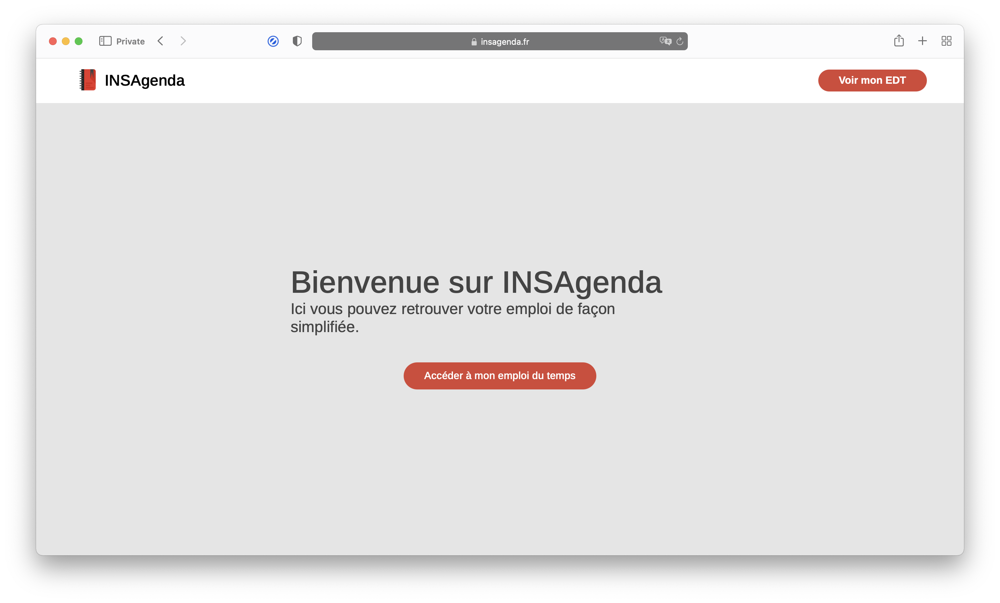
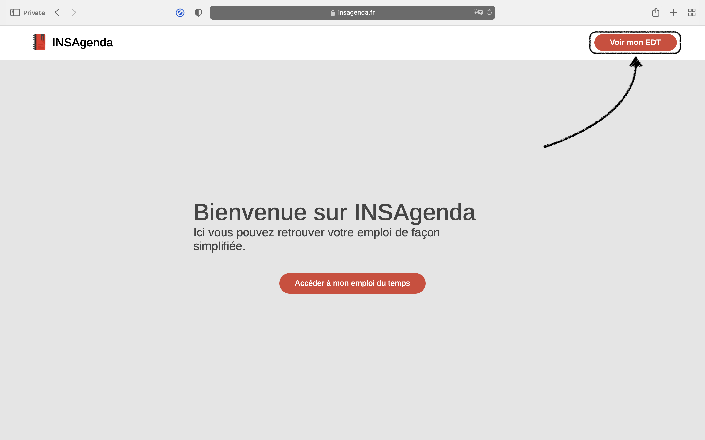
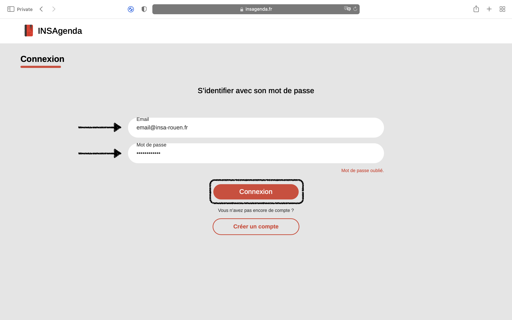
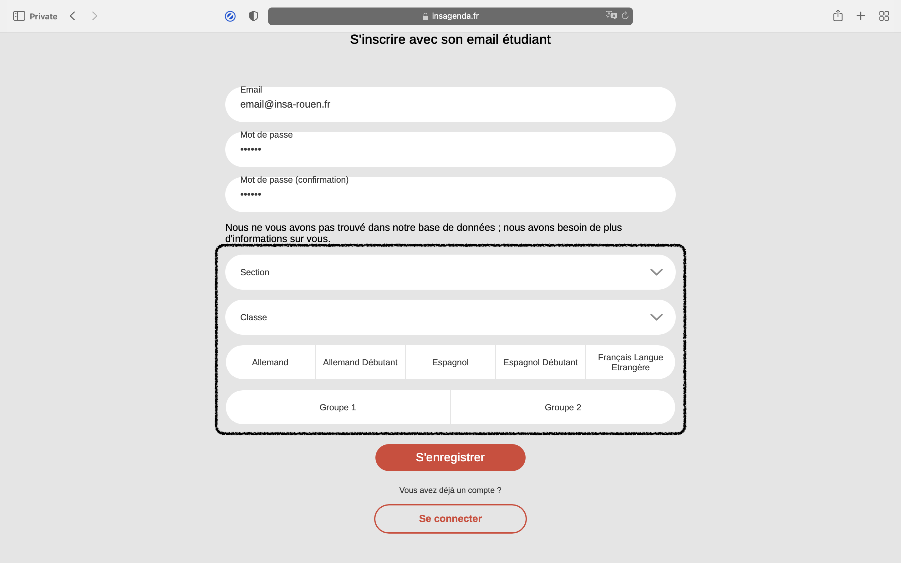

  

  <h3 align="center">Insagenda</h3>

  

    Insagenda is a free website, open source, to consult the timetable at INSA Rouen.
     
    <a href="https://insagenda.fr/index.html"><strong>Explore the website »</strong></a>
     
     
   

<!-- TABLE OF CONTENTS -->

  
Table of Contents

  <ol>
    <li>
      <a href="#about-the-project">About The Project</a>
    </li>
    <li>
      <a href="#creation">Creation</a>
      <ul>
        <li>
          <a href="#structure">Structure</a>
        </li>
        <li>
          <a href="#language">Language</a>
        </li>
      </ul>
    </li>
    <li>
      <a href="#usage">Usage</a>
    </li>
    <li>
      <a href="#authors">Authors</a>
    </li>
    <li>
      <a href="#License">License</a>
    </li>
  </ol>

<!-- Abour the project -->
## About The Project 

 
INSAgenda is a website displays timetables with a new design. It simply retrieves the timetable and displays it with a new design. INSAgenda is an evolving platform, it is constantly updated and improved with new features.
 
 
This repository contains only static files. This excludes the Web-app as well as the backend. All files in this repository will be hosted.

<!-- Creation -->
## Creation
### Structure
The INSAgenda project has this repository which contains the frontend files for the site.
 
 
The INSAgenda structure is : 
<!-- structure -->
<pre>
├── frontend (folder)
│   ├── assets (folder)
│   │   └── (Here are the images and the icons)
│   ├── styles (folder)
│   │   └── (Here are the main stylesheets)
│   ├── Next page (folder)
│   │   ├── page.html (file .html)
│   │   ├── page.css (file .css)
│   │   └── page.js (file .js) 
│   └── index.html (main file .html)
└──
</pre>
In a page's folder, there may not be [.css](https://developer.mozilla.org/fr/docs/Web/CSS) or [.js](https://developer.mozilla.org/fr/docs/Web/JavaScript) files because sometimes they are not needed.

### Language
The INSAgenda project is written in [HTML](https://developer.mozilla.org/fr/docs/Web/HTML), [CSS](https://developer.mozilla.org/fr/docs/Web/CSS) and [JavaScript](https://developer.mozilla.org/fr/docs/Web/JavaScript). (Just for the front-end)
 
 
Usefulness of language :
 - [HTML](https://developer.mozilla.org/fr/docs/Web/HTML) : Marking up elements of a web page.
  - [CSS](https://developer.mozilla.org/fr/docs/Web/CSS) : Tells the browser the style of the page.
  - [JavaScript](https://developer.mozilla.org/fr/docs/Web/JavaScript) : Allows the user to interact with the page dynamically.

<!-- Usage -->
## Usage
To use the INSAgenda service, you must be an INSA Rouen student and have a student email address.
### Step 1
Go to the website [insagenda.fr](https://insagenda.fr)

### Step 2
Click on the button "Voir mon EDT"

### Step 3
You must now log in or create your account. To create your account you must use your email provided by INSA.

### Step 3 (optional)
If after your registration, INSAgenda does not find you, you must fill in the information manually.

### Step 4
Now, you can see your timetable.
 
Good use ! 😉
<!-- Autors -->
## Authors
INSAgenda website is a project created by students.
 
 - [@DimitriTimoz](https://github.com/DimitriTimoz) 
 - [@Mubelotix](https://github.com/Mubelotix) 
 - [@AlexysGromard](https://github.com/AlexysGromard) 

<!-- License -->
## License
The INSAgenda project is licensed. All rights reserved.
 
You can consult this [license](/LICENSE) here.
